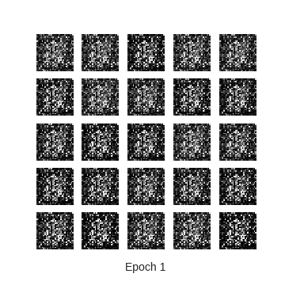
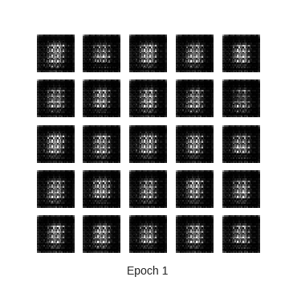
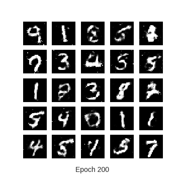
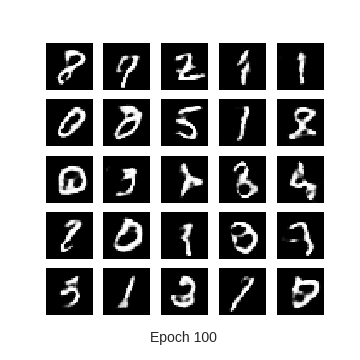

# MNIST Image Generation:  GAN vs DCGAN

TensorFlow 2.0 implementation of Generative Adversarial Networks (GAN) [1] and Deep Convolutional Generative Adversarial Networks (DCGAN) [2] for MNIST [3] dataset.

## Abstract

Recently, the search for creative artificial intelligence has turned to generative adversarial network (GAN), which is currently one of the most popular and successful application of deep learning. Motivated by the ability of GANs to sampling
from a latent space of images to create entirely new images, here we evaluate and compare the
performance of a GAN, where both generator and discriminator are multilayer perceptrons with a
deep convolutional generative adversarial network (DCGAN) on the MNIST dataset.

## Introduction

Sampling from a latent space of images to produce entirely new images is currently one of the most prominent and
successful application of creative artificial intelligence. In this context, generative adversarial networks (or GANs
for short) (Goodfellow et al., 2014), first introduced in 2014, have exploded in popularity as an alternative to variational autoencoders (VAEs) for learning latent spaces of images. They have been used in real-life applications for
text/image/video generation, drug discovery and text-toimage synthesis.

GANs are a kind of generative model that allows us to generate a whole image in parallel, in contrast with recurrent
networks where the model generates the image one pixel at a time. Along with several other kinds of generative models,
GANs use a differentiable function represented by a neural network as a generator G network. The generator network
takes random noise as input, then runs that noise through a differentiable function to transform the noise and reshape it
to have recognizable structure. The output of the generator is a realistic image. The choice of the random input noise
determines which image will come out of the generator network. Running the generator with many different input
noise values produces many different realistic output images.

The goal is for these images to be as fair samples from the distribution over real data. Of course, the generator net
doesn’t start out producing realistic images. It has to be trained. The training process for a generative model is very
different from the training process for a supervised learning model. For a supervised learning model, we show the model
an image of an object and we tell it, this is the label. For a generative model, there is no output to associate with each
image. We just show the model a lot of images and ask it to make more images that come from the same probability
distribution.

<figure>
  
  <figcaption>Scheme representing the general structure of a GAN,
using MNIST images as data. The latent sample is a random vector
the generator uses to construct its fake images. As the generator
learns through training, it figures out how to map these random
vectors to recognizable images that can fool the discriminator. The
output of the discriminator is a sigmoid function, where 0 indicates
a fake image and 1 indicates a real image.</figcaption>
</figure>

## Results

<table align='center'>
<tr align='center'>
<td> GAN</td>
<td> DCGAN</td>
</tr>
<tr>
<td>
<td>
</tr>
</table>

* GAN vs DCGAN

<table align='center'>
<tr align='center'>
<td> GAN after 200 epochs </td>
<td> DCGAN after 100 epochs </td>
</tr>
<tr>
<td>
<td>
</tr>
</table>

* Learning time
    * MNIST GAN - Avg. time for epoch  is 4.564566612243652 sec
    * MNIST DCGAN - Avg. time for epoch is 26.319965600967407 sec

## Reference

[1] Goodfellow, Ian, et al. "Generative adversarial nets." Advances in neural information processing systems. 2014.

(Paper: http://papers.nips.cc/paper/5423-generative-adversarial-nets.pdf)

[2] Radford, Alec, Luke Metz, and Soumith Chintala. "Unsupervised representation learning with deep convolutional generative adversarial networks." arXiv preprint arXiv:1511.06434 (2015).

(Paper: https://arxiv.org/pdf/1511.06434.pdf)

[3] Y. LeCun, L. Bottou, Y. Bengio, and P. Haffner. "Gradient-based learning applied to document recognition." Proceedings of the IEEE, 86(11):2278-2324, Nov 1998.
